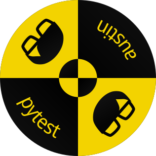

    

<h3 align="center">Profile your Python test runs with Austin</h3>

  
  &nbsp;&nbsp;&nbsp;&nbsp;
  
  &nbsp;&nbsp;&nbsp;&nbsp;
  

  
  
  
  
  

  <a href="#synopsis"><b>Synopsis</b></a>&nbsp;&bull;
  <a href="#installation"><b>Installation</b></a>&nbsp;&bull;
  <a href="#usage"><b>Usage</b></a>&nbsp;&bull;
  <a href="#compatibility"><b>Compatibility</b></a>&nbsp;&bull;
  <a href="#contribute"><b>Contribute</b></a>

  

# Synopsis

~~~
================================ Austin report =================================
Collected stats written on /my/awesome/project/.austin_96369644947159
🕑 Sampling time (min/avg/max) : 479/3242/3440 μs
🐢 Long sampling rate : 315/315 (100.00 %) samples took longer than the sampling interval
💀 Error rate : 0/315 (0.00 %) invalid samples
~~~

# Installation

pytest-austin can be installed directly from PyPI with

~~~ bash
pip install pytest-austin --upgrade
~~~

**NOTE** In order for the plugin to work, the Austin binary needs to be on the
``PATH`` environment variable. See [Austin
installation](https://github.com/P403n1x87/austin#installation) instructions to
see how you can easily install Austin on your platform.

# Usage

# Compatibility

# Contribute

If you like pytest-austin and you find it useful, there are ways for you to
contribute.

If you want to help with the development, then have a look at the open issues
and have a look at the [contributing guidelines](CONTRIBUTING.md) before you
open a pull request.

You can also contribute to the development of the pytest-austin by becoming a
sponsor and/or by [buying me a coffee](https://www.buymeacoffee.com/Q9C1Hnm28)
on BMC or by chipping in a few pennies on
[PayPal.Me](https://www.paypal.me/gtornetta/1).

  

